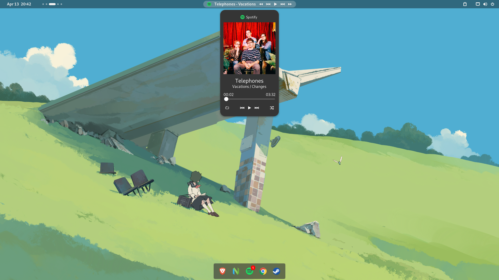

## GNOME

**Extensions**
Dash to Dock
Blur my Shell
Media Controls
Just Perfection
Wallhub
Arcmenu

## i3

- WM - i3-gaps
- Compositor - ibhagwan's picom fork
- Notifications - dunst
- Terminal - Kitty
- Status bars - Polybar
- Lockscreen - i3lock-colors
- Powermenu - rofi
- Shell - fish
- Display Manager - lightdm(lightdm-webkit2-greeter with (glorious theme)[https://github.com/manilarome/lightdm-webkit2-theme-glorious])
